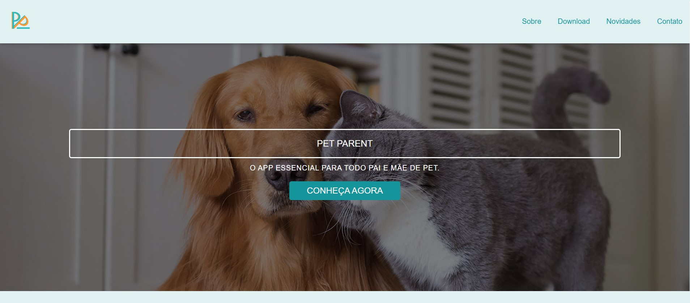
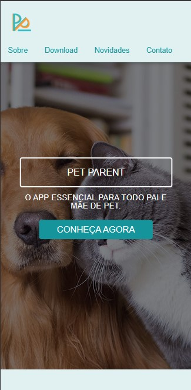

## PetParent Landing Page 🐶

Bem-vindo à página inicial do PetParent App, um aplicativo dedicado aos seus amados animais de estimação! Aqui está uma visão geral rápida do que você precisa saber sobre o nosso site de landing page.

### Descrição do Projeto 🐩

O PetParent é um aplicativo que visa facilitar a vida dos amantes de animais de estimação, oferecendo uma plataforma intuitiva para conectar donos de animais, prestadores de serviços e empresas do ramo pet, além de oferecer recursos para os tutores garantirem um bom gerenciamento da rotina de seus pets. Nossa landing page foi desenvolvida para apresentar de forma cativante os principais recursos e benefícios do PetParent, visando capturar o interesse dos usuários em potencial.

### Recursos Principais 🐕

- **Apresentação Visual Atraente e Responsiva**: Utilizamos um design moderno e amigável para proporcionar uma experiência agradável aos visitantes.

<!-- 
 -->

  

- **Informações sobre o App**: Detalhamos os recursos principais do aplicativo, incluindo agendamento de serviços, comunidade pet, dicas e muito mais.
  
- **Formulário de Contato**: Incluímos um formulário de contato para os interessados entrarem em contato conosco diretamente.

### Tecnologias Utilizadas

Para construir nossa landing page, utilizamos as seguintes tecnologias:

- **HTML5**
- **CSS3**
- **FrameWork Pure CSS**
- **JavaScript**

### Como Utilizar

1. **Visualização Local**:
   - Clone este repositório em sua máquina local.
   - Abra o arquivo `index.html` em seu navegador web para visualizar a landing page.

2. **Visualização Online**:
   - Acesse [PetParent](https://davinicoletto.github.io/pure-css-site/) para ver a landing page online.

### Contribuição

Se você deseja contribuir para o desenvolvimento do PetParent ou reportar problemas, sinta-se à vontade para abrir uma issue ou enviar um pull request para nosso repositório no GitHub.
